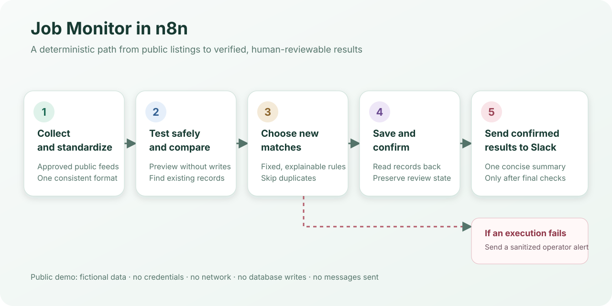

# n8n Job Monitor

An n8n demonstration of turning repeated job-feed checks into one organized
review summary. It helps a job seeker decide what to review next while keeping
applications and career decisions with the person.

## Example result

**Synthetic offline result:** five listings become three matches. One was
already recorded, leaving two new roles for review:

| Role to review | Fictional company |
| --- | --- |
| Workflow Automation Specialist | Northstar Services |
| AI Implementation Consultant | Cedar Labs |

The preview performs **zero database writes and zero Slack sends**. See the
[exact output](examples/expected-preview.json). The public demo illustrates the
workflow; the architecture documents the separate deployed integration.

## My contribution

I designed the collection-to-review workflow, stable record identity, and
verification-before-notification approach, then built this fictional demo for
inspection without access to private systems.

## Explore the project

Start with the example above, then follow the diagram and the
[engineering evidence](#engineering-evidence). Setup is optional for review.

## The problem

Job searches involve repetitive work: checking the same sources, translating
different listing formats, recognizing duplicates, and keeping promising roles
organized. This workflow automates collection and recordkeeping while leaving
applications and career decisions to a person.

## How it works

1. Collect listings from approved public feeds and give them consistent fields.
2. Preview the run and compare listings with records already in the tracker.
3. Apply fixed matching rules and skip jobs that were seen before.
4. Save new matches, read them back, and confirm that the expected records exist.
5. Send one Slack summary containing only verified results.

A separate error workflow creates a short failure alert. Detailed errors stay
in the private n8n execution log instead of being copied into Slack.

## Engineering evidence

| Capability | Implementation | Check |
| --- | --- | --- |
| Match and identify existing roles | [Workflow Code nodes](workflows/job-monitor-demo.json) | [Calculated output and edge cases](scripts/check-workflows.mjs) |
| Reproduce the preview offline | [Graph execution harness](scripts/workflow-harness.mjs) | [Expected result](examples/expected-preview.json) |
| Keep public artifacts credential-free | [Workflow checker](scripts/check-workflows.mjs) | [Verification record](docs/verification.md) |

## Safety and reliability

- **No AI ranking is required.** The same inputs produce the same matching
  result.
- **Preview before writing.** Collection and matching can be tested without
  creating records or sending notifications.
- **Verify after saving.** A successful request is not accepted as proof that
  every expected record was stored correctly.
- **Preserve human decisions.** A listing that reappears does not silently reset
  its previous review state.
- **Notify after verification.** Slack receives only results that passed the
  final checks.
- **Keep failures concise.** Shared alerts identify where the run stopped while
  private logs retain the detailed error.

## Optional offline demo

The demo uses five fictional listings and one fictional existing record. It
makes no network requests, writes to no database, and sends no Slack messages.

1. Import [`workflows/job-monitor-demo.json`](workflows/job-monitor-demo.json)
   into n8n 2.x.
2. Open **Job Monitor — Offline Recruiter Demo**.
3. Select **Execute workflow**.
4. Inspect **Build Slack Message Preview**.

The expected preview shows five collected listings, three matches, one existing
listing skipped, two new matches, and zero live actions. See the
[demo guide](docs/demo-guide.md) for the node sequence and expected output.

## Public demo boundary

| Public repository | Deployed workflow |
| --- | --- |
| Fictional job fixtures | Approved public job feeds |
| Example matching rules | Private role-profile rules |
| Preview only | Save, link, read back, and verify |
| No credentials or messages | Private n8n credentials and Slack delivery |

The public artifacts were prepared specifically for review. They contain no
private endpoints, identifiers, production exports, job-search history, or
application data.

## Limitations

- This is a monitor and review aid, not an automatic application bot.
- Fixed matching rules are clear but less flexible than semantic matching.
- The public demo does not contact job sites, NocoDB, Slack, or another service.
- Source availability still depends on each provider's access rules and rate
  limits.
- An n8n error workflow cannot report that its own server is completely offline;
  an independent uptime monitor is needed for that case.

## Project guide

- [Architecture](docs/architecture.md)
- [Offline demo](docs/demo-guide.md)
- [Verification record](docs/verification.md)
- [Security policy](SECURITY.md)
- [Public/private boundary](docs/provenance.md)
- [Expected preview](examples/expected-preview.json)

Copyright © 2026 Mark Cruz. Released under the [MIT License](LICENSE).
