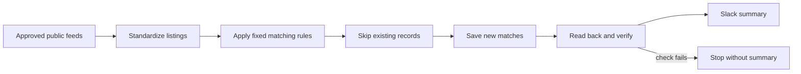

# Architecture and design decisions

## One visible path from collection to notification

The production design keeps the primary business path linear and readable:

The public demo mirrors collection, standardization, matching, duplicate classification, and message formatting. External reads and writes are replaced with fictional data and preview output.

## Why deterministic matching

The workflow does not need a language model to decide whether a listing matches the configured role profile. Fixed rules are a better fit for the initial system because they are:

- repeatable: the same listing produces the same result;
- inspectable: each match includes the terms that contributed;
- inexpensive: no model or token cost is required;
- easier to debug: a reviewer can see why a listing passed or failed.

An optional semantic-ranking stage could be added later, but it should enrich rather than silently override the fixed eligibility rules.

## Preview and live modes

Preview mode tests the upstream workflow without changing external state. It is useful when editing source mappings, normalization, or matching rules because repeated runs cannot create database duplicates.

Live mode loads existing tracking records before preparing writes. Stable record keys allow the workflow to identify previously seen listings even when the same result appears in a later feed.

These are related but distinct protections:

- preview mode makes testing non-mutating;
- existing-record checks make live runs idempotent.

## Save, read back, then report

The production workflow does not equate an accepted database request with a verified outcome. It reads the affected records back and checks that both the job records and their organizing relationships exist. Existing human-review state is preserved.

Only the verified branch can build the normal Slack summary. A failed check stops before notification, preventing a message from claiming that incomplete records were saved successfully.

## Error handling

The main workflow points to a separate n8n error workflow. That workflow:

1. receives failed-execution context through an Error Trigger;
2. keeps only the workflow name, execution identifier, and last node;
3. directs the operator to the private execution log for details;
4. retries Slack delivery a bounded number of times.

This catches workflow execution failures. It cannot send an alert if the complete n8n service or host is unavailable, because the notifier would be unavailable too. Full outage coverage requires an independent watchdog.

## Public/private boundary

The deployed workflow uses private integration identifiers, endpoints, schedules, and credentials stored by n8n. Publishing a production export would preserve more operational structure than a public portfolio needs.

The public workflows therefore use clean, fictional inputs and no external nodes. They demonstrate the decisions and execution shape without providing access to a private system or implying that the demo itself performed a live production run.
